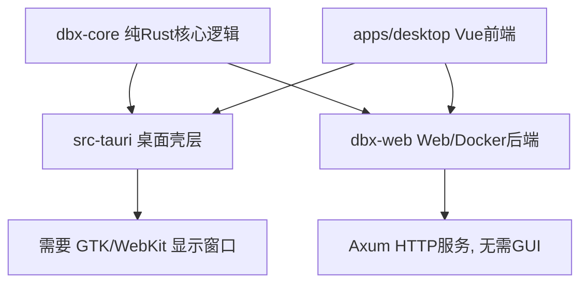
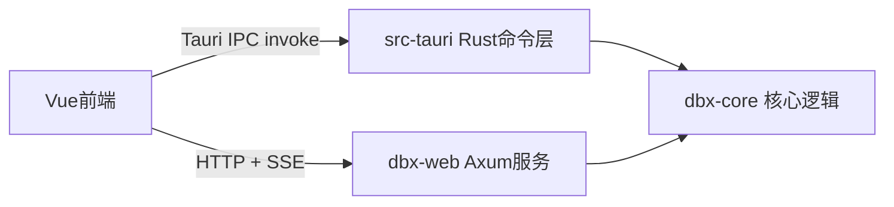
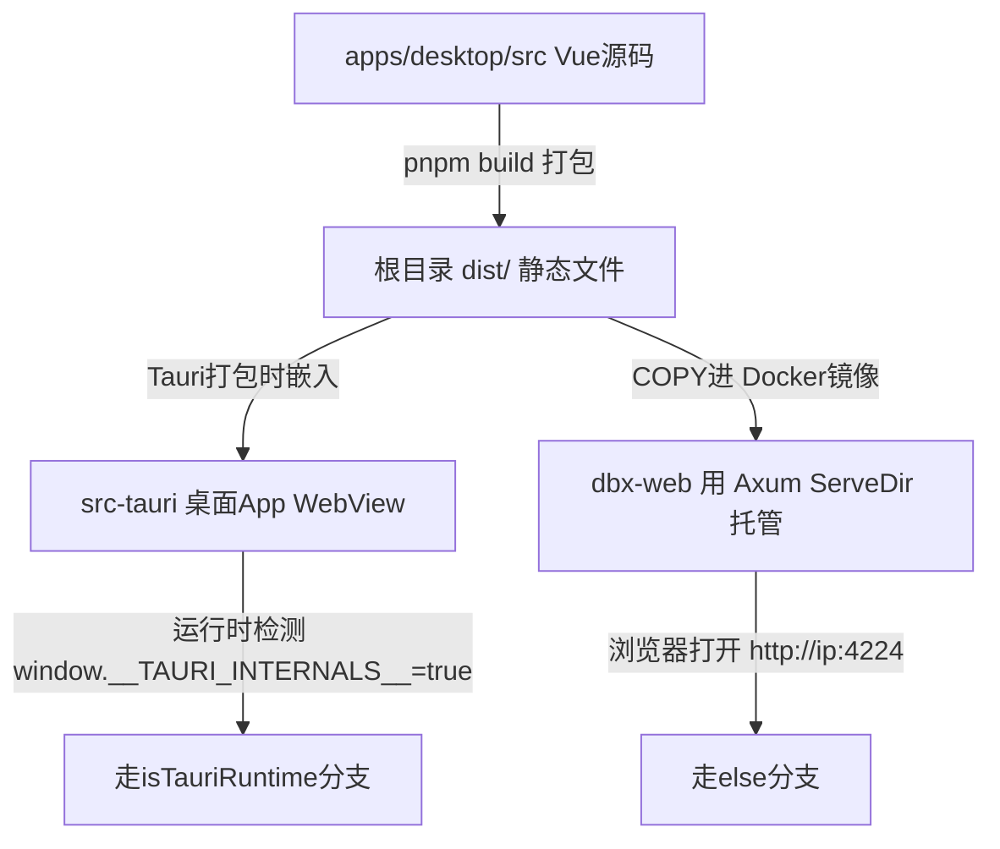

# DBX 项目分析与新人上手指南

> 项目地址：https://github.com/t8y2/dbx
> 整理日期：2026-07-10
> 使用场景：新手（熟悉 Vue，Rust 仅学过一点、无实际开发经验）参与开源贡献前的技术调研笔记

---

## 一、项目简介

**DBX** 是一款开源的跨平台数据库客户端/管理工具：

- 体积小（约 20MB），无需 Java/Python/内置 Chromium
- 支持 60+ 种数据库（MySQL、PostgreSQL、SQLite、Redis、MongoDB、DuckDB、ClickHouse、SQL Server、Oracle 等）
- 内置 AI SQL 助手（支持 Claude / OpenAI / 本地 Ollama 模型）
- 支持 MCP（Model Context Protocol），可被 Claude Code / Cursor / Windsurf 等 AI Agent 调用查询数据库
- 支持三种形态：桌面端（Tauri）、Docker 自托管、Web 版本
- 开源协议：Apache-2.0，GitHub 9.6k star（活跃项目，89+ release）

---

## 二、技术栈总览

| 层级 | 技术 | 说明 |
|---|---|---|
| 跨平台框架 | **Tauri 2** | Rust 后端逻辑 + Web 技术界面，打包体积远小于 Electron |
| 前端 | **Vue 3 + TypeScript** | 组合式 API，Pinia 状态管理，Vue I18n 国际化 |
| UI 组件 | **shadcn-vue + Tailwind CSS 4 + reka-ui** | 现代化组件方案 |
| 编辑器 | **CodeMirror 6** | SQL 语法高亮、自动补全、Vim 模式 |
| 图表 | **ECharts (vue-echarts)** | ER 图、Explain Plan 等可视化 |
| 后端核心 | **Rust** | 数据库连接、SQL 执行等核心逻辑 |
| 数据库驱动 | **sqlx / tiberius / redis-rs / mongodb** 等 | 分别对接各类数据库 |
| Agent 驱动 | **Java + Gradle (JDK 21)** | JDBC 兼容数据库（Snowflake、Neo4j、BigQuery 等） |
| 构建工具 | **pnpm workspace + Vite + Cargo workspace** | monorepo 管理 |
| 代码质量 | **oxlint + oxfmt + rustfmt + husky + lint-staged** | |
| 测试 | **Vitest（前端）/ Cargo test（Rust）** | |
| 文档站 | **Next.js**（`docs/` 目录） | `make docs` 本地预览 |

GitHub 语言占比：Rust 33.3%、TypeScript 32.7%、Vue 23.4%、Java 8.1%、Go 1.1%。

### Monorepo 目录结构

```
dbx/
├── apps/desktop/       # Vue 3 桌面前端（Tauri 渲染层）
├── src-tauri/          # Tauri 壳层 + Rust 命令层（唯一依赖 GUI/Tauri 的地方）
├── crates/
│   ├── dbx-core/        # 核心 Rust 数据库逻辑，纯逻辑，不依赖任何 GUI
│   └── dbx-web/         # Docker/Web 部署的 HTTP 后端（基于 Axum）
├── packages/
│   ├── cli/             # @dbx-app/cli npm 包
│   ├── mcp-server/      # @dbx-app/mcp-server，MCP 协议服务
│   └── node-core/       # Node.js 桥接层
├── agents/              # JDBC Agent 驱动（Java/Gradle）
├── docs/                # 官方文档站（Next.js）
├── examples/            # CLI/MCP/Docker/API 使用示例
└── deploy/              # Docker 部署配置
```

**架构关键点**：`dbx-core`（核心业务逻辑）完全不依赖 Tauri/GUI，只有 `src-tauri` 才依赖 GTK/WebKit。`dbx-web` 基于 Axum，是纯 HTTP 服务。这意味着桌面版和 Web 版共享同一套核心逻辑，只是壳层不同。



---

## 三、Ubuntu 24.04 Server 能否开发测试

**结论：可以，而且很适合。**

| 开发内容 | 能否在无 GUI 的 Server 上做 | 说明 |
|---|---|---|
| Vue 前端开发 (`apps/desktop/src`) | ✅ 完全可以 | `make dev-web` 起服务，浏览器访问（配合 SSH 端口转发） |
| Rust 核心逻辑 (`crates/dbx-core`) | ✅ 完全可以 | 纯逻辑代码，`cargo check`/`cargo test` 不需要显示器 |
| Web/Docker 后端 (`crates/dbx-web`) | ✅ 完全可以 | Axum HTTP 服务，天然适合服务器跑 |
| 各类数据库联调测试 | ✅ 非常适合 | 可直接用 Docker 在服务器上起 MySQL/PostgreSQL/Redis/MongoDB 等测试实例 |
| Tauri 桌面壳层 (`src-tauri`) | ⚠️ 只能编译，不能看运行效果 | 编译需要 `libwebkit2gtk` 等库的头文件，但运行窗口需要真实/虚拟显示器（Xvfb），新手阶段没必要折腾 |

### 服务器依赖安装清单

```bash
# 基础工具链
sudo apt update
sudo apt install -y build-essential pkg-config libssl-dev cmake git curl

# Rust（如果未安装）
curl --proto '=https' --tlsv1.2 -sSf https://sh.rustup.rs | sh

# Node.js（要求 >= 22.13.0，建议用 nvm 管理，项目根目录有 .nvmrc）
# pnpm（要求版本 10.27.0，见 package.json 的 packageManager 字段）
```

### 开发方式

```bash
git clone https://github.com/t8y2/dbx.git
cd dbx

make dev-web       # 只启动前端（Web 模式）
make dev-backend   # 只启动 Web 后端（Axum）
```

如果服务器和本机不在同一网络，用 SSH 端口转发访问：

```bash
ssh -L 5173:localhost:5173 -L 4224:localhost:4224 user@server
```

第一次编译因为默认包含 DuckDB（bundled 编译很慢），建议先用跳过它的快速模式：

```bash
make cargo-check-fast   # 快速 Rust 检查，跳过 DuckDB
make dev-fast           # Tauri dev 跳过 DuckDB（但仍需要 GUI 依赖才能编译）
```

---

## 四、新手上手路线（Vue 熟练 + Rust 仅学过理论）

### 第一阶段：用强项建立信心（第1周）
1. 先把开发环境跑起来，找一个**前端/文档类的 `good first issue`**，走一遍完整的 Fork → 开发 → PR 流程，熟悉贡献规范。
2. 阅读 `apps/desktop/src/composables/`，搞清楚前端如何调用后端命令（Tauri `invoke` 或 Web 模式下的 HTTP 调用），理清前后端的接口边界。

### 第二阶段：破冰 Rust（第2-3周）
**避免一开始就读 `agent_*.rs`**（AI Agent 逻辑最复杂，涉及状态机、流式事件，容易劝退）。建议顺序阅读 `crates/dbx-core/src/`：

1. `types.rs`、`connection.rs` —— 基础数据结构（struct/enum），友好易懂
2. `sql_dialect.rs` + `sql_dialect/` 目录 —— 各数据库 SQL 方言差异，实现模式高度相似，适合当第一个练习对象
3. `redis_ops.rs` 或 `mongo_ops.rs` —— 挑一个自己熟悉的数据库看 CRUD 实现

**学习技巧**：这个代码库里同一类功能（导出 CSV、SQL 方言格式化等）往往对多个数据库各写一份实现，风格高度一致。可以：
- 找到要修的 bug 所在的数据库实现
- 参考另一个相似数据库（如 PostgreSQL vs MySQL）已有的正确实现
- "模式匹配"着改，比单纯啃 Rust Book 更有实感
- 多跑 `cargo check`，Rust 编译器报错信息详细，本身就是很好的学习资料

### 第三阶段：正式贡献代码（第4周起）
去 Issues 找 label 是具体数据库 + bug 性质的问题（如 "mysql connection timeout"、"redis scan cursor"），范围小、有明确复现路径，且大概率能找到"姊妹实现"参考。

### 建议先避开的领域
- `agent_*.rs`（AI Agent 循环、工具调用）—— 异步状态机复杂
- `driver_runtime.rs` / `jdbc.rs`（JDBC agent 桥接）—— 涉及 Java 进程调用，链路长
- `src-tauri/` 中窗口、系统托盘、深链接相关代码 —— 在无 GUI 服务器上验证不了效果

---

## 五、参与贡献流程（依据 CONTRIBUTING.zh-CN.md）

### 环境要求
- Node.js >= 22.13.0
- pnpm 10.27.0
- Rust >= 1.77
- Make
- （可选）JDK 21，仅当改动 `agents/` 目录的 JDBC 驱动时需要

### 常用命令

```bash
make                   # 安装依赖并启动 Tauri 桌面开发环境
make dev-fast           # 本地开发跳过 DuckDB
make dev-web            # 只启动前端
make dev-backend        # 只启动 Web 后端
make docs               # 本地预览文档站
make cargo-check-fast   # 快速 Rust 检查
make cargo-test-fast    # 快速 Rust 测试
```

### 贡献步骤
1. **找任务**：浏览 [Issues](https://github.com/t8y2/dbx/issues)，优先看 `good first issue`、`documentation` 标签，部分 Issue 支持评论 `/claim` 认领
2. **认领**：在 Issue 下留言说明要做什么，避免重复劳动
3. **开发**：Fork 仓库 → 新建分支（命名如 `fix/mysql-connection-timeout`、`feat/redis-key-search`、`docs/xxx`）
4. **提交规范**：commit message 用自然语言写清楚，如 `fix(redis): handle empty scan cursor`
5. **验证**：
   ```bash
   make cargo-check-fast
   make cargo-test-fast
   pnpm test
   ```
6. **提 PR**：推到自己 Fork，向 `main` 分支提 PR，描述中关联 Issue，涉及 UI 改动要附截图

### 原则
- 一个 PR 只做一类事，改动越小越容易合并
- 修 bug 时不要顺手做无关的大重构

### 特别欢迎的贡献类型
- 文档改进与翻译（门槛低，适合新手）
- 有清晰复现步骤的 Bug 修复
- 有真实测试环境的小众数据库专项修复
- 补充非平凡逻辑的测试
- CLI/MCP/Docker/Web API 的使用示例

### 社区渠道
- Discord: https://discord.gg/W7NyVDRt6a
- GitHub Issues: https://github.com/t8y2/dbx/issues
- 官方文档: https://dbxio.com/cn/docs/what-is-dbx
- 贡献者墙: https://dbxio.com/cn/community

---

## 六、Tauri 桌面壳层 与 浏览器 Web 访问的差异分析

**核心结论**：桌面版和 Web 版共享同一套 `dbx-core` 业务逻辑，但外壳层（壳）有多处实质性差异，并非“完全一样”。



### 1. 通信方式不同

- **桌面版**：前端通过 `@tauri-apps/api` 的 `invoke()` 直接调用 Rust 函数，是进程内通信，没有网络开销。
- **Web 版**：前端通过 HTTP 请求 + SSE（`crates/dbx-web/src/sse.rs`）与后端通信，AI 流式回复、长查询进度等都走 Server-Sent Events，本质上多了一层网络往返。

前端专门有运行时检测函数 `isTauriRuntime()`（`apps/desktop/src/lib/backend/tauriRuntime.ts`），通过判断 `window.__TAURI_INTERNALS__` 是否存在来分流逻辑：

```ts
export function isTauriRuntime(...): boolean {
  return Boolean(globalObject.__TAURI_INTERNALS__ || globalObject.__TAURI__);
}
```

### 2. 身份认证——最大的差异点

- **桌面版**：**没有登录/密码机制**。应用运行在用户本机，操作系统级别的用户权限就是天然的访问控制。
- **Web 版**：`crates/dbx-web/src/auth.rs` 实现了一整套认证系统——Argon2 密码哈希、Cookie Session、登录失败限流锁定（5 次失败锁 60 秒）、首次访问强制设置密码（`setup_required`）。因为 Web 版可能部署在公网/局域网，任何能访问该端口的人都能连接已配置好的数据库，必须有门禁。

### 3. 文件系统访问方式不同

以导出功能为例（`apps/desktop/src/composables/useDataGridExport.ts` 里几十处这种写法）：

```ts
if (isTauriRuntime()) {
  const { save } = await import("@tauri-apps/plugin-dialog");
  const path = await save({ defaultPath: outputPath, filters: [...] });
  // 直接写入用户选择的本机路径
} else {
  // 走浏览器下载（Blob + <a download>），文件进浏览器默认下载目录
}
```

- **桌面版**：用系统原生“另存为”对话框，可选任意本机路径，因为 Tauri 的 `fs` 插件有本地文件系统读写权限。
- **Web 版**：浏览器是沙箱环境，无法自由读写文件系统，只能触发浏览器下载，文件固定进“下载”目录；“导入 SQL 文件”等操作也必须走 `<input type="file">` 上传，而桌面版可以直接监听系统的“用文件打开方式”。

### 4. 数据存储位置不同

- **桌面版**（`src-tauri/src/data_dir.rs`）：数据库配置、密码等存在操作系统的应用数据目录（如 Windows 的 `AppData\Roaming`），还支持“便携模式”（exe 同目录放 `data` 文件夹）。
- **Web/Docker 版**：数据存在容器挂载的 volume 里（`DBX_DATA_DIR` 环境变量指定），本质上是同一套 SQLite 存储层，只是路径解析逻辑不同。

### 5. 系统级集成——桌面版独有

`src-tauri/src/lib.rs` 里注册了一批 Web 版完全没有对应物的原生能力：

| 功能 | 说明 |
|---|---|
| 系统托盘图标 | `TrayIconBuilder`，macOS/Windows 上最小化到托盘 |
| 单实例锁 | `tauri_plugin_single_instance`，防止开多个窗口 |
| 深链接 (Deep Link) | 支持 `dbx://` 协议直接从浏览器/其它 App 打开连接 |
| 原生窗口状态记忆 | `tauri_plugin_window_state`，记住窗口大小位置 |
| 自动更新 | `tauri_plugin_updater`，桌面版能自我检测并静默更新；Web/Docker 版本靠自己 `docker pull` 新镜像 |
| 系统剪贴板 | `tauri_plugin_clipboard_manager`，更完整的剪贴板能力 |
| macOS Dock 菜单 | `macos_app_delegate.rs` 处理 Dock 图标的 Quit 行为 |

### 6. 多用户 / 并发模型

- **桌面版**：单用户假设，`AppState` 是进程内单实例。
- **Web 版**：`WebState` 里维护了 `sessions`（多会话并存）、登录限流状态，理论上支持多个浏览器/多人同时连一个后端（虽然连接的是同一份数据库配置）。

### 一句话总结

> 业务逻辑一样，但“壳”不一样：Tauri 版是“受操作系统信任的本机程序”，能直接摸系统资源（文件、托盘、剪贴板）且不需要登录；Web 版是“暴露在网络上的服务”，必须有认证和会话管理，且受浏览器沙箱限制，文件操作退化为上传/下载。

### 对开发/测试的实际影响

在无 GUI 的 Ubuntu 服务器上做开发时，**核心业务逻辑（`dbx-core`）的验证是完全等价的**，但如果一个 bug 恰好出在“文件导出对话框”“托盘图标”“深链接”这类壳层代码里，Web 模式测不出来、也修不了——这类问题必须在有桌面环境（本机 Windows/macOS/带显示器的 Linux）的机器上验证。

---

## 七、浏览器里看到的界面到底是什么代码？

**结论**：浏览器打开 Web 版看到的界面，与桌面版是**同一份 `apps/desktop/src` Vue 源码构建出来的同一份产物**，并不存在两套独立的 UI 代码。



### 证据链

1. **前端构建配置** `apps/desktop/vite.config.ts` 里：
   ```ts
   build: {
     outDir: "../../dist",   // 打包输出到项目根目录的 dist/
     ...
   }
   ```

2. **Tauri 配置** `src-tauri/tauri.conf.json` 里：
   ```json
   "build": {
     "frontendDist": "../dist",   // 桌面版直接把 dist/ 塞进 WebView
     "beforeBuildCommand": "pnpm build"
   }
   ```

3. **Docker 镜像构建** `deploy/Dockerfile` 里：
   ```dockerfile
   COPY apps/desktop/ apps/desktop/
   RUN pnpm build                        # 同一条构建命令
   COPY --from=frontend /app/dist /app/static   # 把同一份 dist/ 拷进最终镜像
   ENV DBX_STATIC_DIR=/app/static
   ```

4. **`dbx-web` 后端服务静态文件** `crates/dbx-web/src/main.rs` 第586行：
   ```rust
   if let Ok(static_dir) = std::env::var("DBX_STATIC_DIR") {
       let serve_dir = ServeDir::new(&static_dir)
           .not_found_service(ServeFile::new(&index_path));  // SPA路由兼底到index.html
       app = app.fallback_service(serve_dir);
   }
   ```

### 结论总结

- **没有单独的“Web 版界面”代码**，也没有第二套前端仓库/目录
- 浏览器里看到的每个组件、每个页面（`apps/desktop/src/components/`、`stores/`、`composables/` 等）跟桌面版是**逐字节相同的构建产物**
- 唯一的区别是：这份 `dist/` 被谁“喂”给浏览器——桌面版是 Tauri 的原生 WebView 直接加载本地文件；Web 版是 `dbx-web`（Axum）把它当静态资源通过 HTTP 托管出去
- 页面加载后，前端代码在**运行时**通过检测 `window.__TAURI_INTERNALS__` 这个全局对象是否存在，来判断“我现在是被 Tauri 加载的，还是被普通浏览器加载的”，从而决定走原生文件对话框还是浏览器下载这类分支逻辑（就是前面分析的差异点）

### 对实际开发的意义

这意味着：**在 `apps/desktop/src/` 里改的任何 Vue 组件/样式/交互逻辑，同时对桌面版和 Web 版生效**，不用改两处。这也是为什么你在无 GUI 的 Ubuntu 服务器上跑 `make dev-web`（起 `apps/desktop` 的 Vite 开发服务器）+ `make dev-backend`（起 `dbx-web`），就能完整开发和调试几乎所有前端功能——因为本质上就是在开发桌面版会用到的那同一套前端。
